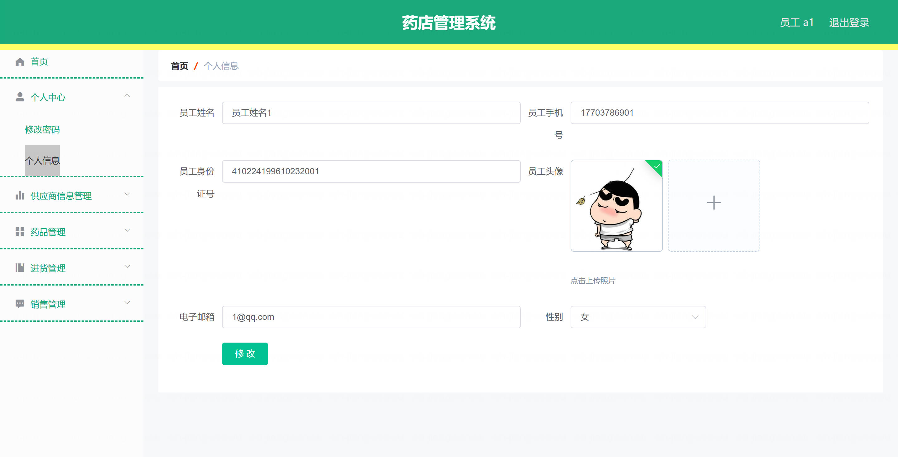
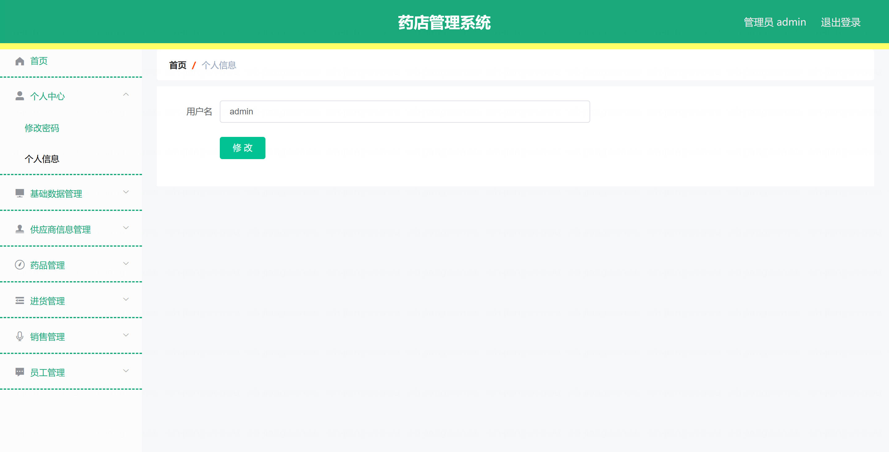

基于Springboot的药店管理系统（程序+论文）
=

### 完整代码获取地址：从戎源码网 ([https://armycodes.com/](https://armycodes.com/))
### 作者微信：19941326836  QQ：952045282 
### 承接计算机毕业设计、Java毕业设计、Python毕业设计、深度学习、机器学习
### 选题+开题报告+任务书+程序定制+安装调试+论文+答辩ppt 一条龙服务
### 所有选题地址https://github.com/nature924/allProject

一、项目介绍
---

基于SpringBoot+Vue的药店管理系统，系统角色为管理员、员工，主要功能如下

管理员：
基本操作：登录、修改密码、获取个人信息、修改个人信息
系统参数配置：查看系统参数、修改系统参数
基础数据管理：
供应商类型管理：新增、查看、修改、删除
供应商信用等级类型管理：新增、查看、修改、删除
药品类型管理：新增、查看、修改、删除
性别类型管理：新增、查看、修改、删除
供应商信息管理：筛选供应商、获取供应商列表、查看供应商详情、新增供应商、删除供应商、修改供应商
药品管理：筛选药品、获取药品列表、查看药品详情、新增药品、删除药品、修改药品
进货管理：筛选进货记录、获取进货列表、查看进货详情、新增进货、删除进货、修改进货
销售管理：筛选销售记录、获取销售列表、查看销售详情、新增销售、删除销售、修改销售、生成报表
员工管理：筛选员工、获取员工列表、查看员工详情、新增员工、删除员工、修改员工
用户管理（管理员账号）：筛选用户、获取用户列表、查看用户详情、新增用户、删除用户、修改用户

员工：
基本操作：登录、修改密码、获取个人信息、修改个人信息
供应商信息管理：获取供应商列表、查看供应商详情
药品管理：获取药品列表、查看药品详情
进货管理：获取进货列表、查看进货详情、新增进货
销售管理：获取销售列表、查看销售详情、新增销售

二、项目技术
---
- 编程语言：Java
- 数据库：MySQL
- 项目架构：B/S架构
- 前端技术：JSP
- 后端技术：Spring、SpringMVC、MyBatis

三、运行环境
---
- 操作系统：Windows、macOS都可以
- JDK版本：JDK1.8以上都可以
- 开发工具：IDEA、Ecplise、Myecplise都可以
- 数据库: MySQL5.7以上都可以
- Tomcat：任意版本都可以
- Maven：任意版本都可以

四、运行截图
---
### 论文截图：

### 程序截图：

